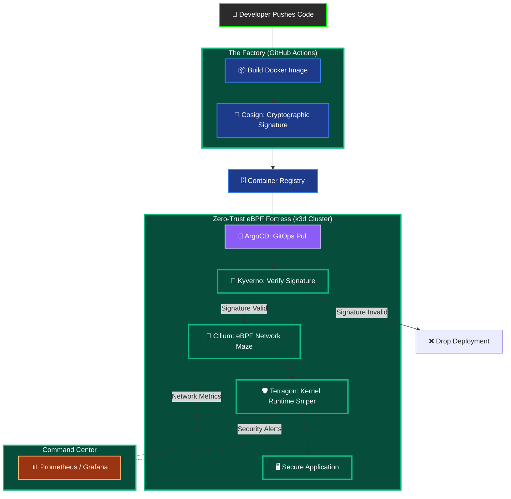
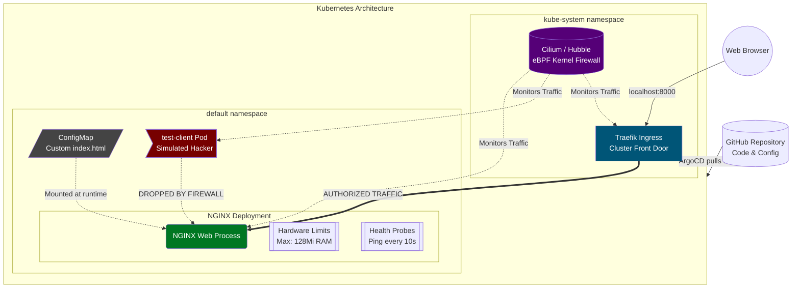

```mermaid
graph TD
    %% Styling
    classDef dev fill:#2b2b2b,stroke:#00ff00,stroke-width:2px,color:#fff;
    classDef ci fill:#1e3a8a,stroke:#3b82f6,stroke-width:2px,color:#fff;
    classDef gitops fill:#8b5cf6,stroke:#c4b5fd,stroke-width:2px,color:#fff;
    classDef cluster fill:#064e3b,stroke:#10b981,stroke-width:3px,color:#fff;
    classDef monitor fill:#9a3412,stroke:#fdba74,stroke-width:2px,color:#fff;

    %% Nodes
    Dev[👤 Developer Pushes Code]:::dev
    
    subgraph "The Factory (GitHub Actions)"
        Build[📦 Build Docker Image]:::ci
        Sign[🔏 Cosign: Cryptographic Signature]:::ci
    end
    
    Registry[🗄️ Container Registry]:::ci
    
    subgraph "Zero-Trust eBPF Fortress (k3d Cluster)"
        Argo[🚚 ArgoCD: GitOps Pull]:::gitops
        Kyverno[🛑 Kyverno: Verify Signature]:::cluster
        Cilium[🐝 Cilium: eBPF Network Maze]:::cluster
        Tetragon[🛡️ Tetragon: Kernel Runtime Sniper]:::cluster
        App[🖥️ Secure Application]:::cluster
    end
    
    subgraph "Command Center"
        Prometheus[📊 Prometheus / Grafana]:::monitor
    end

    %% Flow
    Dev --> Build
    Build --> Sign
    Sign --> Registry
    Registry --> Argo
    Argo --> Kyverno
    
    Kyverno -- "Signature Invalid" --> Reject[❌ Drop Deployment]
    Kyverno -- "Signature Valid" --> Cilium
    
    Cilium --> Tetragon
    Tetragon --> App
    
    Cilium -. "Network Metrics" .-> Prometheus
    Tetragon -. "Security Alerts" .-> Prometheus
```

```mermaid
flowchart TD
    %% Source of Truth
    Git[(GitHub Repository\nCode & Config)] -->|ArgoCD pulls changes| Cluster
    
    subgraph Cluster [Kubernetes Architecture]
        direction TB
        
        subgraph KubeSystem [kube-system namespace]
            direction LR
            Traefik[Traefik Ingress\nCluster Front Door]
            Hubble[(Cilium / Hubble\neBPF Kernel Firewall)]
        end

        subgraph Default [default namespace]
            direction TB
            Config[/ConfigMap\nCustom index.html/]
            
            subgraph Pods [NGINX Deployment]
                direction TB
                App(NGINX Web Process)
                Limits[[Hardware Limits\nMax: 128Mi RAM]]
                Probes[[Health Probes\nPing every 10s]]
            end
            
            Hacker>test-client Pod\nSimulated Hacker]
        end
    end
    
    %% Decoupled Config Injection
    Config -.->|Mounted at runtime| App

    %% Network Flow & Zero Trust
    User((Web Browser)) -->|localhost:8000| Traefik
    Traefik ==>|AUTHORIZED TRAFFIC| App
    Hacker -.->|DROPPED BY FIREWALL| App
    
    %% Observability
    Hubble -.->|Monitors Traffic| Traefik
    Hubble -.->|Monitors Traffic| Hacker
    Hubble -.->|Monitors Traffic| App

    %% Styling 
    style Traefik fill:#005577,color:#fff
    style Hubble fill:#550077,color:#fff
    style App fill:#007722,color:#fff
    style Hacker fill:#770000,color:#fff
    style Config fill:#444,color:#fff
```